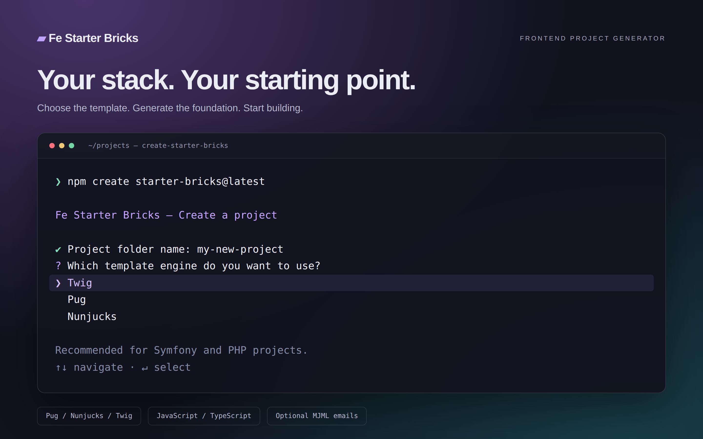
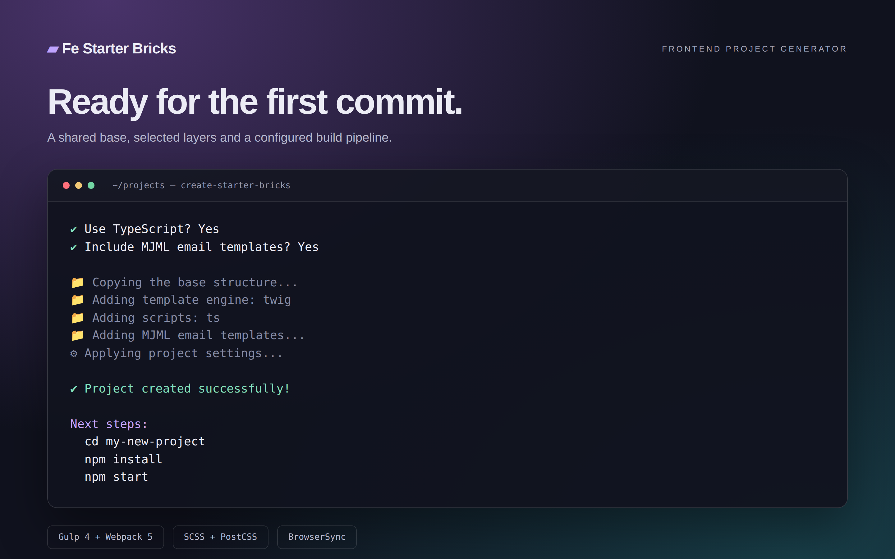

# Fe Starter Bricks

[](https://www.npmjs.com/package/create-starter-bricks)
[](https://nodejs.org/)
[](https://github.com/evscoder/fe-starter-bricks/blob/master/LICENSE)

An interactive CLI that creates a frontend project with your choice of template engine, JavaScript or TypeScript, and optional MJML emails.

Use it for multipage websites, CMS themes, Symfony views, and static frontend integration. Each project combines a shared base template with the technology layers you select.

## Quick start

```bash
npm create starter-bricks@latest
```

The CLI asks for:

| Setting | Choices | Default |
| --- | --- | --- |
| Project folder | A lowercase folder name, such as `my-new-project` | `my-new-project` |
| Template engine | Twig, Pug, or Nunjucks | Twig |
| Scripts | TypeScript or JavaScript | TypeScript |
| Email templates | Include or skip MJML | Skip |



*Styled illustration based on the CLI interface.*

Once generation finishes, install dependencies and start development:

```bash
cd my-new-project
npm install
npm start
```

Open [localhost:4200](http://localhost:4200/) in your browser. BrowserSync reloads the page when project files change.



*Styled illustration of generation with optional MJML emails enabled.*

### Other package managers

Choose one of these alternatives to the npm command above:

```bash
npx create-starter-bricks@latest
```

```bash
yarn create starter-bricks@latest
```

```bash
pnpm create starter-bricks@latest
```

```bash
bun create starter-bricks@latest
```

```bash
bunx create-starter-bricks@latest
```

## Requirements

- Node.js `>= 20.12.0`.
- npm, Yarn, pnpm, or Bun to run the generator.
- npm to follow the generated project's commands below.

The generator creates the project in the current directory. Use a folder name rather than a path. Names may contain lowercase letters, numbers, dots, hyphens, and underscores; Windows reserved names are rejected. An existing destination folder must be empty.

## Included tooling

| Area | Tools |
| --- | --- |
| Templates | Your selected engine: Twig, Pug, or Nunjucks |
| Build pipeline | Gulp 4 and Webpack 5 |
| Scripts | JavaScript or TypeScript |
| Styles | SCSS, PostCSS, and Tailwind CSS support |
| Development | BrowserSync with file watching and live reload |
| Assets | Image optimization and SVG/PNG sprite support |
| Emails | Optional MJML templates and compilation |
| Code quality | ESLint and Stylelint configuration |

Gulp handles templates and asset processing. Webpack bundles scripts and styles. Build options are stored in `user.config.js`.

## Project commands

Run these commands inside the generated project:

| Command | Purpose |
| --- | --- |
| `npm start` | Build the project, start the local server, and watch for changes |
| `npm run build` | Create the production output in `build/` |
| `npm run lint` | Run ESLint on `src/` with automatic fixes; warnings fail the command |

## Generated structure

```text
my-new-project/
├── src/
│   ├── assets/          # Images, SVG files, favicons, and static assets
│   ├── js/ or ts/      # Selected script layer
│   ├── styles/          # SCSS styles
│   └── templates/       # Pages, layouts, and components
│       └── emails/      # Present when MJML is selected
├── build/               # Generated build output
├── user.config.js       # Build and template settings
└── package.json         # Project dependencies and commands
```

The CLI also copies the build configuration and a README with instructions for the generated project.

## Configuration

Edit `user.config.js` in the generated project to adjust the build:

| Option | Purpose |
| --- | --- |
| `templateEngine` | Selected template engine: `twig`, `pug`, or `nunjucks` |
| `typeScript` | Enable TypeScript compilation |
| `folderBuild` | Output directory; defaults to `build` |
| `assetsBuild` | Compiled assets path; defaults to `build/assets` |
| `serverIndexPage` | Local server entry page; defaults to `index.html` |
| `emailsBuild` | Enable MJML compilation |
| `optimizeImages` | Enable image optimization |
| `spritePng` | Enable PNG sprite generation; disabled by default |

The CLI sets `templateEngine`, `typeScript`, and `emailsBuild` from your answers. Changing these values later does not copy additional template layers into the project.

### Email templates

Choose MJML during setup to include the email sources in `src/templates/emails/`. Compiled HTML is written to `build/emails/`.

After starting development, open an included email such as [localhost:4200/emails/address.html](http://localhost:4200/emails/address.html).

## Repository development

The CLI lives in `packages/create-starter-bricks/`. Its `templates/` directory contains the shared base and separate layers for template engines, scripts, and emails.

To run the local generator from the repository root:

```bash
npm install
npm run dev
```

## License

MIT
